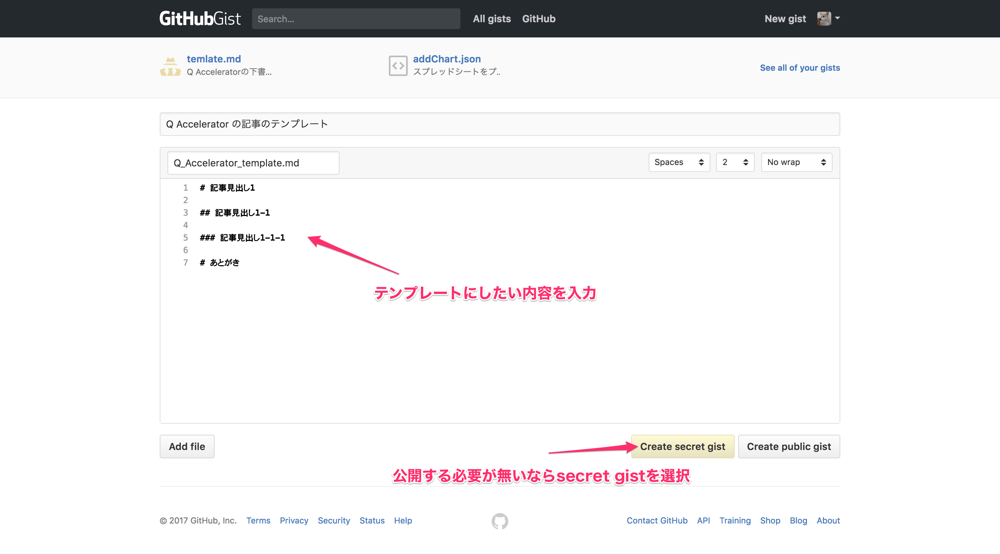
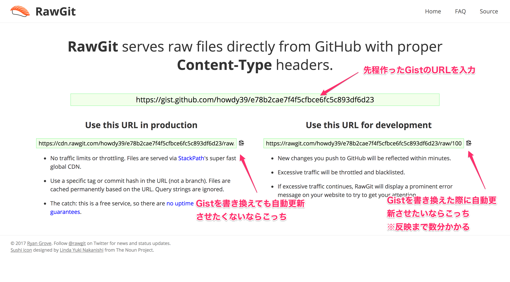

# 記事テンプレートのファイルURLの作成方法
2パターンだけ記載しておきます。  
※Ajaxで取得できるURLならなんでもOKです。

1. [DropBoxを利用する](#1dropboxを利用する)
2. [Gist + RawGitを利用する](#2gist--rawgitを利用する)

# 1.DropBoxを利用する

Dropboxのやり方はできなくなりました。
http://www.appbank.net/2017/03/17/iphone-application/1322133.php

# 2.Gist + RawGitを利用する

## Gistにアクセスしファイルを作成
[https://gist.github.com/](https://gist.github.com/)

## RawGitにアクセスしURLを取得
[https://rawgit.com/](https://rawgit.com/)

