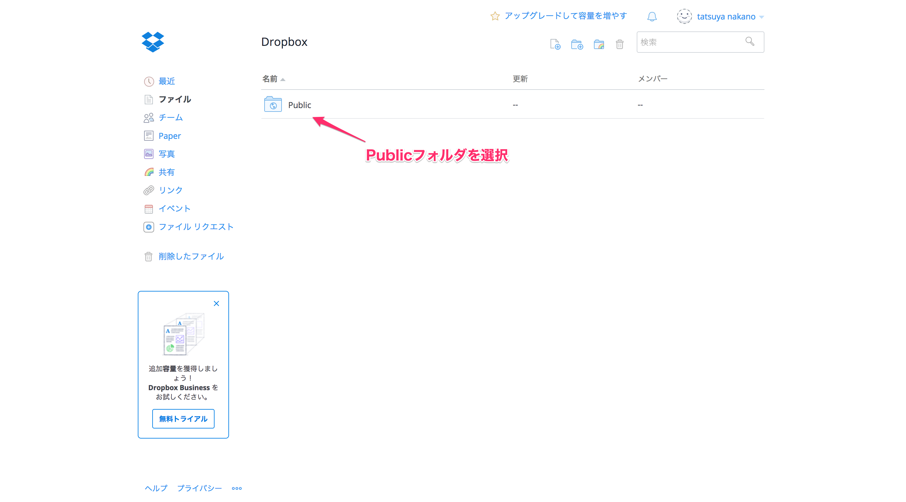
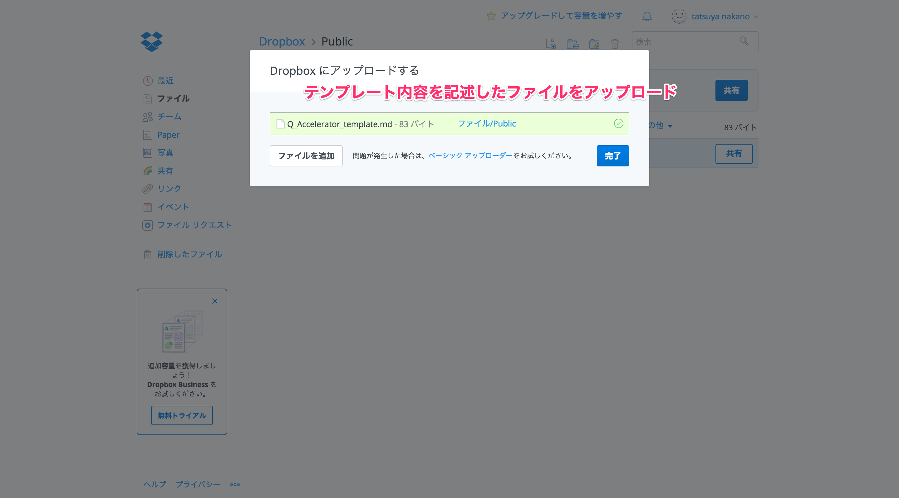
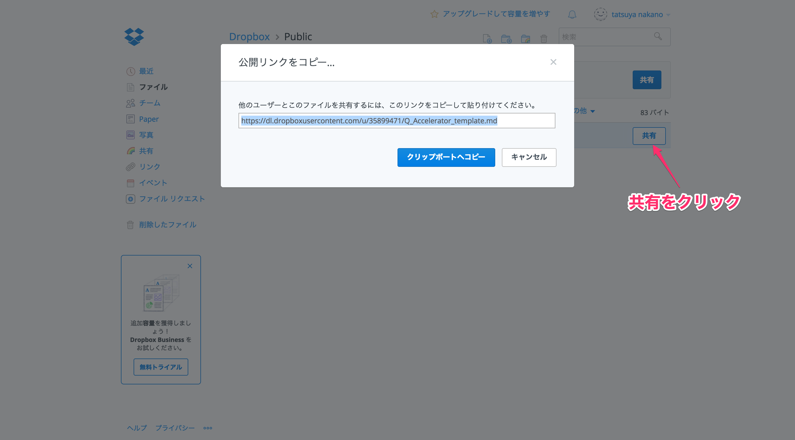

# 記事テンプレートのファイルURLの作成方法
2パターンだけ記載しておきます。  
※Ajaxで取得できるURLならなんでもOKです。

1. [DropBoxを利用する](#%201.DropBoxを利用する)
2. [Gist + RawGitを利用する](#%202.Gist%20+%20RawGitを利用する)

# 1.DropBoxを利用する

## DropBoxにアクセスしPublicフォルダに移動
[https://www.dropbox.com/home](https://www.dropbox.com/ho)

## ファイルをアップロード

## URLを取得

# 2.Gist + RawGitを利用する

## Gistにアクセスしファイルを作成
[https://gist.github.com/](https://gist.github.com/)

## RawGitにアクセスしURLを取得
[https://rawgit.com/](https://rawgit.com/)

